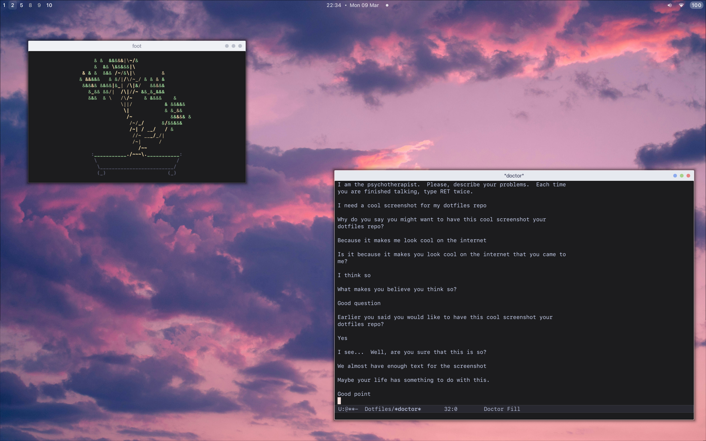

# Config files

./install.sh requires [GNU Stow](https://www.gnu.org/software/stow/)

# TODO
- [ ] Split i3 config into different files
    - Doesn't work on current version of i3 :(
- [ ] Try to move dmenu config here without breaking git
- [ ] Replace stow */ with individual calls, move scripts dir here
